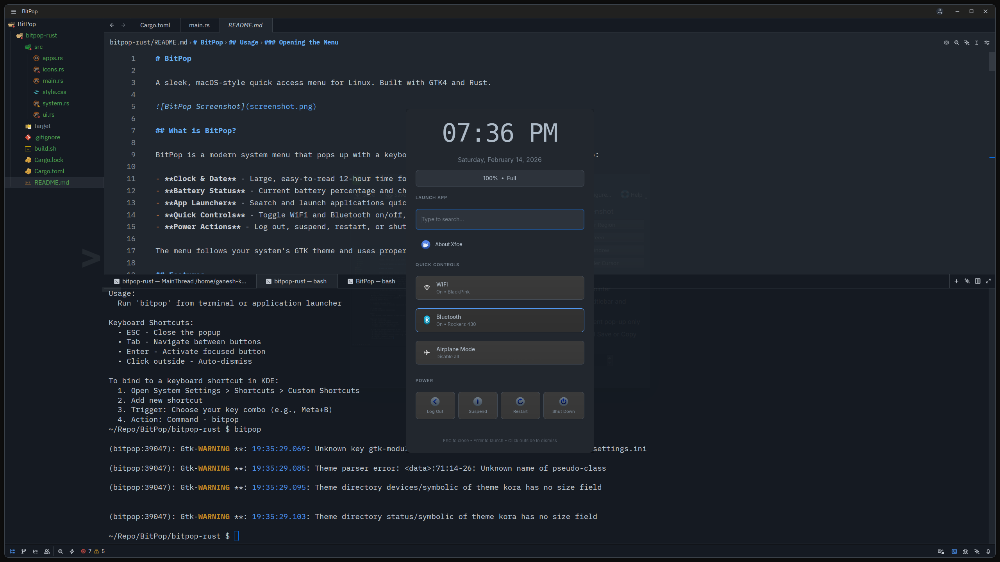

# BitPop

A sleek access menu for Linux. Built with GTK4 and Rust.



## What is BitPop?

BitPop is a keyboard-triggered system control hub designed as an alternative to traditional status bars and bottom/top app launchers.
Instead of occupying permanent screen space, BitPop appears instantly via a keyboard shortcut and provides a clean, centralized interface for essential system interactions.
* **Clock & Date**
  Large, easy-to-read 12-hour time display with AM/PM.
* **Battery Status**
  Real-time battery percentage and charging state.
* **App Launcher**
  Fast search and launch for installed applications.
* **Quick Controls**
  Toggle Wi-Fi and Bluetooth, and view connected networks and devices.
* **Power Actions**
  Log out, suspend, restart, or shut down the system.

### Design Philosophy

* No persistent UI clutter
* Keyboard-first workflow
* Native GTK theme integration
* System icon consistency

BitPop provides a minimal, focused system menu that stays out of the way until you need it.

## Features

- **Clean Design** - Minimal, centered popup that doesn't clutter your screen
- **Keyboard Friendly** - Full keyboard navigation with Tab and Enter
- **Quick Access** - Press Super/Command key again to toggle close
- **Smart Search** - Type to filter apps instantly
- **System Integration** - Uses your existing GTK icon theme and colors
- **Auto-Close** - Click outside the menu or press ESC to dismiss

## Requirements

- Linux system with GTK4
- NetworkManager (for WiFi controls)
- BlueZ/bluetoothctl (for Bluetooth controls)
- systemd (for power actions)

### Install Dependencies

**Arch Linux:**
```bash
sudo pacman -S gtk4 networkmanager bluez
```

**Ubuntu/Debian:**
```bash
sudo apt install libgtk-4-dev network-manager bluez
```

**Fedora:**
```bash
sudo dnf install gtk4-devel NetworkManager bluez
```

## Installation

### From Source

1. **Clone the repository:**
```bash
git clone https://github.com/ganeshspeaks/bitpop.git
cd bitpop
```

2. **Build the project:**
```bash
cargo build --release
```

3. **Install to your system:**
```bash
sudo cp target/release/bitpop /usr/local/bin/
sudo chmod +x /usr/local/bin/bitpop
```

4. **(Optional) Copy desktop file for application menu:**
```bash
sudo cp bitpop.desktop /usr/share/applications/
```

### Create Keyboard Shortcut

To open BitPop with a keyboard shortcut:

**GNOME:**
1. Open Settings → Keyboard → Keyboard Shortcuts
2. Click "+" to add custom shortcut
3. Name: BitPop
4. Command: `bitpop`
5. Set your preferred key combination (e.g., Super+Space)

**KDE:**
1. Open System Settings → Shortcuts → Custom Shortcuts
2. Edit → New → Global Shortcut → Command/URL
3. Trigger: Set your key combination
4. Action: `bitpop`

**i3/Sway:**
Add to your config:
```
bindsym $mod+space exec bitpop
```

## Usage

### Opening the Menu
- Use your configured keyboard shortcut, or
- Run `bitpop` from terminal, or
- Click the BitPop icon in your application menu

### Navigation
- **Type** - Search for apps immediately
- **Tab** - Move focus from search to quick controls
- **Enter** - Launch selected app or activate focused button
- **ESC** - Close menu (clears search first if text present)
- **Super/Command** - Toggle menu open/close
- **Click outside** - Close menu

### Quick Controls
- **WiFi** - Shows "On" or "Off". Displays connected network name when available
- **Bluetooth** - Shows "On" or "Off". Displays connected device name when available
- **Airplane Mode** - Disables all radios

## Configuration

BitPop automatically uses your system's GTK theme and icon theme. To customize appearance:

1. Change your GTK theme in system settings
2. Change your icon theme in system settings
3. Restart BitPop to apply changes

## Troubleshooting

### Icons not showing
Make sure you have a complete icon theme installed:
```bash
# Arch
sudo pacman -S adwaita-icon-theme

# Ubuntu/Debian
sudo apt install adwaita-icon-theme

# Fedora
sudo dnf install adwaita-icon-theme
```

### WiFi controls not working
Ensure NetworkManager is running:
```bash
systemctl status NetworkManager
```

### Bluetooth controls not working
Ensure Bluetooth service is running:
```bash
systemctl status bluetooth
```

### Menu doesn't appear
- Check if another instance is running (lock file at `/tmp/bitpop.lock`)
- Try running from terminal to see error messages: `bitpop`
- Ensure GTK4 is properly installed

## Project Structure

```
src/
├── main.rs      # Application entry point
├── ui.rs        # Main window and UI components
├── system.rs    # WiFi, Bluetooth, and battery functions
├── apps.rs      # App launcher and desktop file parsing
└── icons.rs     # Icon loading utilities
```

## Development

### Build
```bash
cargo build
```

### Run
```bash
cargo run
```

### Build Release
```bash
cargo build --release
```

## License

MIT License - See LICENSE file for details

## Credits

Built with:
- [GTK4](https://gtk.org/) - GUI toolkit
- [Rust](https://rust-lang.org/) - Programming language
- Inspired by macOS Control Center
